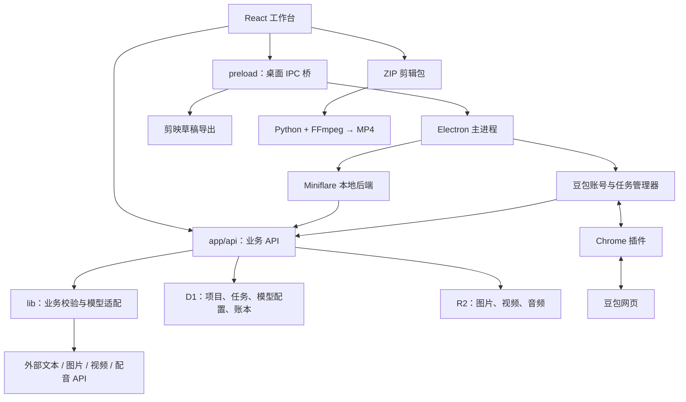

# AI 短片导演工作台：代码库架构地图

> 最新状态：请先阅读 [开发交接](development-handoff.md)。当前桌面为 v0.1.69；本文下方版本与验证描述包含历史记录，不能直接当作当前发布状态。

侦察日期：2026-09-14  
项目根目录：`ai-director-studio`  
用途：接手工程时建立整体认知，作为后续阅读、排查和变更的索引。

> 本文依据侦察时的工作区源码，不等同于 Git 已提交版本或已安装程序。侦察时已有大量未提交修改。本文不是逐文件审计，也不代表模型、豆包和剪映链路全部通过实机验证。文件链接使用相对路径，方便仓库迁移后继续查阅。

## 一、项目定位、技术栈与目录地图

### 1. 项目是做什么的

这是一个以“项目—分镜—资产”为中心的 AI 短片制作工作台，采用“一套 Web 界面与 API + Electron 桌面封装 + 豆包浏览器插件”的架构。

业务主线：一句话创意 → 故事候选 → 剧本 → 分镜与资产 → 图片/视频生成 → 配音 → 剪辑导出。当前是用户逐步审阅、操作和保存的创作工具，不是无人工参与的一键成片服务。整片输出通过剪映草稿或离线 Python + FFmpeg 完成。

旁支能力包括 Skill 创作规则管理、跨项目资产复用，以及代理、收益和结算登记。

### 2. 技术栈

| 层次 | 实现 | 依据 |
|---|---|---|
| 前端 | TypeScript、React 19、Tailwind CSS 4、shadcn/Base UI | [package.json](../package.json) |
| Web 框架 | vinext + Vite 8，采用 Next 风格 App Router 目录与接口 | [vite.config.ts](../vite.config.ts) |
| API 运行环境 | Cloudflare Workers；前后端同仓 | [server.ts](../lib/server.ts) |
| 数据与文件 | D1（SQLite）、R2；Drizzle 定义表结构和迁移 | [schema.ts](../db/schema.ts) |
| 桌面端 | Electron 44、Node.js、Miniflare | [桌面 package.json](../desktop/package.json)、[backend.mjs](../desktop/backend.mjs) |
| 浏览器插件 | JavaScript、Chrome Manifest V3、Service Worker、页面脚本 | [manifest.json](../browser-extension/manifest.json) |
| 视频导出 | Python、FFmpeg；剪映草稿 JSON、ffprobe | [render.py](../public/render.py)、[jianying-export.cjs](../desktop/jianying-export.cjs) |
| 工程工具 | pnpm、TypeScript、oxlint/oxfmt、Node 断言测试脚本 | [package.json](../package.json)、[core.mjs](../tests/core.mjs) |

虽然存在 `next.config.ts` 和 Next 风格导入，实际开发、构建脚本调用的是 vinext，主要构建配置在 Vite 中。主要语言为 TypeScript/TSX、JavaScript（含 CJS/MJS）、CSS、SQL；Python 主要用于离线渲染，PowerShell 用于桌面图标辅助制作。

### 3. 目录地图与分类

```text
ai-director-studio/
├── app/                    页面入口、全局样式、HTTP API
│   ├── page.tsx            工作台总入口与状态编排
│   ├── layout.tsx          页面外壳
│   └── api/                项目、模型、生成、素材、配音等接口
├── components/             创作、分镜、资产、任务、模型设置等界面
│   └── ui/                 通用 UI 基础组件
├── lib/                    业务规则、数据类型、模型适配、导出逻辑
├── db/                     数据表定义与数据库接入
├── drizzle/                SQL 迁移及结构快照
├── desktop/                桌面源码、打包脚本、测试及生成目录
│   ├── main.cjs            Electron 主进程入口
│   ├── preload.cjs         页面调用桌面能力的桥梁
│   ├── backend.mjs         本地后端启动器
│   ├── worker.mjs          桌面会话校验与请求入口
│   ├── doubao-manager.cjs  豆包账号、任务与结果管理
│   └── jianying-templates/ 剪映草稿模板，属于运行资源
├── browser-extension/      豆包助手插件源代码
├── public/                 静态资源，包含有业务意义的 render.py
├── hooks/                  通用 React Hook
├── tests/                  业务与集成测试脚本
├── docs/                   专题说明、排查记录、架构地图
└── work/                   临时转译、测试数据、参考与调试文件
```

| 分类 | 目录或文件 | 阅读与维护建议 |
|---|---|---|
| 核心源码 | `app`、业务 `components`、`lib`、桌面核心脚本、`browser-extension` | 优先阅读 |
| 基础设施与运行资源 | `components/ui`、`db`、`drizzle`、`public/render.py`、剪映模板、配置和锁文件 | 不必逐个先读，但不是可随意删除的文件 |
| 依赖 | 各级 `node_modules` | 不作为业务源码阅读 |
| 构建、缓存、测试产物 | `dist`、`.next`、`.vinext`、`.wrangler`、`__pycache__`、`*.tsbuildinfo`、`desktop/runtime`、`desktop/release`、`desktop/test-results` | 侦察时跳过正文；`.wrangler` 可能含本地持久化数据，不能直接当垃圾清理 |
| 插件复制或分发产物 | `desktop/doubao-extension`、`public/doubao-extension.zip` | 插件源代码以 `browser-extension` 为准 |
| 开发中间文件与历史说明 | `work`、README 的历次版本记录、专题排查文档 | 辅助查因，不能单凭名称判断可删除 |

桌面构建和插件复制关系见 [prepare.mjs](../desktop/prepare.mjs)，忽略规则见 [根 .gitignore](../.gitignore) 与 [桌面 .gitignore](../desktop/.gitignore)。侦察未逐文件读取依赖、缓存、日志、二进制和大型媒体文件。

## 二、整体架构、启动入口与核心模块

### 1. 系统整体架构



这是同仓前后端加桌面本地服务，未发现独立 Python/Java 后端工程。桌面版复用 Web 后端，将运行环境和存储搬到本机；豆包管理器另开本地 HTTP 服务。

### 2. 启动入口与配置

**Web 开发：** 根目录 `pnpm dev` → `vinext dev` → Vite 插件加载 Workers 环境 → [layout.tsx](../app/layout.tsx) 和 [page.tsx](../app/page.tsx)。构建命令为 `pnpm build`，`pnpm start` 通过 Wrangler 运行构建结果。

**桌面：** [main.cjs](../desktop/main.cjs) → fork [backend.mjs](../desktop/backend.mjs) → Miniflare 初始化本地 D1/R2、执行迁移 → 返回随机本地端口 → Electron 加载页面并启动豆包管理器。[worker.mjs](../desktop/worker.mjs) 校验桌面会话 Cookie 与同源请求。

**桌面构建：** Web 构建 → `prepare:runtime` 复制构建、迁移和插件 → `package` 打包。侦察时 [package.mjs](../desktop/package.mjs) 明确面向 Windows x64，桌面源码版本为 0.1.57。修改 Web 源码不会自动更新桌面 `runtime` 或已发布程序。

| 配置 | 用途 |
|---|---|
| [package.json](../package.json) | Web 脚本、依赖与 Node 版本要求 |
| [vite.config.ts](../vite.config.ts) | vinext、Sites、Cloudflare、CSS 插件与本地绑定 |
| [.openai/hosting.json](../.openai/hosting.json) | Sites 项目信息、DB/FILES 绑定名称 |
| [wrangler.local.json](../wrangler.local.json) | 本地 D1/R2 和迁移配置 |
| [drizzle.config.ts](../drizzle.config.ts) | 数据表来源、迁移输出和 SQLite 方言 |
| [tsconfig.json](../tsconfig.json) | TypeScript、运行环境类型、`@/*` 路径别名 |
| [.env.example](../.env.example)、[.dev.vars.example](../.dev.vars.example) | 模型环境变量名称示例，不含实际密钥 |
| [desktop/package.json](../desktop/package.json) | 桌面入口、版本、脚本和依赖 |
| [browser-extension/manifest.json](../browser-extension/manifest.json) | 插件入口、权限、匹配站点；侦察时版本 0.13.0 |

### 3. 核心模块及职责

| 模块 | 职责 | 主要代码 |
|---|---|---|
| 工作台与项目 | 导航、当前项目、编辑状态、保存、弹窗、结果回填 | [page.tsx](../app/page.tsx)、[studio.ts](../lib/studio.ts) |
| 创作与导演助手 | 故事方案、剧本、分镜；Skill 修改提议、校验、应用和撤销 | [creative-workspace.tsx](../components/creative-workspace.tsx)、[director.ts](../lib/director.ts)、[导演 API](../app/api/director/route.ts) |
| 分镜与资产 | 剧本资产提取、镜头引用匹配、资产版本与跨项目复用 | [assets.ts](../lib/assets.ts)、[asset-library.ts](../lib/asset-library.ts)、[storyboard-rows.tsx](../components/storyboard-rows.tsx) |
| 模型与生成 | 配置、密钥加密、请求协议、任务记录、查询和下载 | [models.ts](../lib/models.ts)、[model-server.ts](../lib/model-server.ts)、[generation-server.ts](../lib/generation-server.ts) |
| 视频上下文 | 组合人物/场景参考图、首帧、对白、音色约束 | [video-context.ts](../lib/video-context.ts)、[video-request.ts](../lib/video-request.ts)、[video-voice.ts](../lib/video-voice.ts) |
| 配音与时间轴 | 台词配音生成、裁切与字幕时间对齐 | [speech-server.ts](../lib/speech-server.ts)、[dialogue-timeline.ts](../lib/dialogue-timeline.ts) |
| 豆包自动化 | 多账号、独立 Chrome 配置、任务队列、页面操作、结果匹配与回传 | [doubao-manager.cjs](../desktop/doubao-manager.cjs)、[background.js](../browser-extension/background.js) |
| 剪辑与导出 | 预览、素材包、字幕、剪映草稿和离线合成 | [sequence-preview.tsx](../components/sequence-preview.tsx)、[export.ts](../lib/export.ts) |
| 附属业务账本 | 渠道代理、两级分佣、收益和结算登记 | [business.ts](../lib/business.ts)、[business API](../app/api/business/route.ts) |

平台 Skill 是创作规则文本，不是执行本机脚本或工具的代理程序。[Skill 导入 API](../app/api/skills/import/route.ts) 会校验格式，必要时调用文本模型适配，并交由用户审阅保存。

## 三、核心业务流程与完整调用链

### 1. 一句话 → 故事 → 剧本 → 分镜

`CreativeWorkspace → Home.generate(task) → POST /api/ai → textRequest → modelRequest → 外部 /chat/completions → 返回正文/JSON → 前端审阅应用 → 保存项目`

[page.tsx](../app/page.tsx) 的 `generate` 根据任务选择输入：故事使用创意，剧本使用故事，分镜使用剧本，并附带画风、画幅、所选 Skill 和资产信息。[ai/route.ts](../app/api/ai/route.ts) 负责系统提示词、结果完整性检查和分镜结构校验。

故事可以生成多个候选；其他结果进入审阅弹窗。分镜应用走 `applyStoryboardImport → matchShotAssets → validateProject`，再写入前端项目状态。依据：[director.ts](../lib/director.ts)、[assets.ts](../lib/assets.ts)。

**关键粒度：一行工作台分镜对应一个生成视频段。** 导入 JSON 的一个 `episode` 可以包含多个内部子镜头，但不会被拆成多个工作台行。平台也兼容旧的平铺 `shots` 格式。依据：[storyboard-episodes.ts](../lib/storyboard-episodes.ts)、[storyboard-contract.ts](../lib/storyboard-contract.ts)。

### 2. 剧本/资产 → 图片与视频

资产识别：`AssetSync → POST /api/assets → 文本模型提取 → reviewAssetDrafts → 用户确认合并 → Project.assets`。

[资产 API](../app/api/assets/route.ts) 是识别接口，不是独立资产表的 CRUD。另有 [assets.ts](../lib/assets.ts) 中的明确标签解析与匹配规则，资产仍嵌在项目中。

生成链：`GenerationDialog.submit → POST /api/generations → submitJob → 配置/参数/参考素材校验 → 写 generation_jobs → 调用供应商 → 查询任务 → 下载结果 → R2 + media → 回填分镜`。

关键实现：[generation-tools.tsx](../components/generation-tools.tsx)、[生成 API](../app/api/generations/route.ts)、[generation-server.ts](../lib/generation-server.ts)。

提交前会组合分镜正文、资产参考、对白和音色约束，不同供应商使用不同请求格式。任务先按 ID 幂等落库，再发起上游请求；重复查询不会主动重新生成。完成后 `receiveGeneratedVideos` 按项目和镜头 ID 回填，并防止旧任务覆盖用户后来上传的视频。依据：[video-generation.ts](../lib/video-generation.ts)。

首帧、站位图和前镜头截图关联分别见 [frame-reference.ts](../lib/frame-reference.ts)、[blocking-image.ts](../lib/blocking-image.ts)、[first-frame-control.tsx](../components/first-frame-control.tsx)。

### 3. 豆包生成：独立于模型 API 的通道

`分镜 → doubaoBundle 打包提示词/参考图 → preload IPC → DoubaoManager 入队 → 选择账号 → 插件领取 → 配置网页并提交 → 观察请求/页面结果 → 管理器下载 → POST /api/media → 回填原分镜`

依据：[doubao.ts](../lib/doubao.ts)、[preload.cjs](../desktop/preload.cjs)、[doubao-manager.cjs](../desktop/doubao-manager.cjs)、[background.js](../browser-extension/background.js)、[前端结果接收](../lib/doubao-manager.ts)。

插件负责网页侧执行：登录识别、创作页面准备、参数配置、内容填写、提交确认、生成进度和结果探测。页面脚本还会观察网络响应并提取媒体。桌面管理器负责账号分配、并发、额度约束、暂停、任务状态与结果下载。

插件本身不生成视频，也不通过 API Key 调用模型；实际使用登录的豆包账号及其额度。它依赖豆包网页结构、会话和媒体地址，不能将静态实现等同于现网页已验证可用。

### 4. 配音与最终成片

配音：`SpeechControls → POST /api/speech → submitSpeech → /audio/speech 或自定义路径 → 保存音频 → 回填对应台词 → 时间轴对齐`。依据：[speech API](../app/api/speech/route.ts)、[speech-server.ts](../lib/speech-server.ts)、[dialogue-timeline.ts](../lib/dialogue-timeline.ts)。

两种成片出口：

- **剪映草稿**：`exportJianyingDraft → IPC → exportJianying`，下载素材、探测时长与尺寸，生成视频、配音、字幕、BGM 轨道及草稿文件；最终成片由剪映导出。见 [jianying-export.cjs](../desktop/jianying-export.cjs)。
- **离线 MP4**：`exportKit` 打包项目 JSON、素材、SRT 和 `render.py`。用户解压运行 Python，FFmpeg 完成裁切、缩放、拼接、配音/BGM 混合，输出 `output.mp4`；字幕为独立 SRT。见 [export.ts](../lib/export.ts)、[render.py](../public/render.py)。

单素材上传限制 50 MB，浏览器剪辑包总素材限制约 180 MB。剪辑包在浏览器内存中组装。项目 JSON 不是完整媒体备份；桌面导入项目 JSON 时会移除不可用媒体引用，并作为新项目保存。依据：[media API](../app/api/media/route.ts)、[export.ts](../lib/export.ts)、[main.cjs](../desktop/main.cjs)。

### 5. 任务调度的实际边界

未发现统一的 Redis/BullMQ/Celery 类后台任务队列。当前是三种机制：

| 任务 | 调度方式 | 运行边界 |
|---|---|---|
| 文字生成 | HTTP 请求内等待；NDJSON 心跳和最终结果 | 没有持久化文字任务队列；心跳不是模型逐字流式输出 |
| 普通图片/视频 | 任务落 D1；图片批次由前端控制并发；视频由前端定时查询 | 页面关闭后，不能假设应用仍持续查询、下载和回填；供应商侧任务可能仍继续 |
| 豆包任务 | Electron 管理器调度，JSON 持久化，插件轮询与事件回传 | 状态可恢复，但依赖桌面进程、Chrome 和账号状态 |

依据：[api-response.ts](../lib/api-response.ts)、[image-batch-queue.ts](../lib/image-batch-queue.ts)、[use-generation-jobs.ts](../components/use-generation-jobs.ts)、[video-generation.ts](../lib/video-generation.ts)、[doubao-manager.cjs](../desktop/doubao-manager.cjs)。

## 四、数据流、数据库结构与外部依赖

### 1. 数据流

项目编辑与生成任务是两条分别保存的数据流：

`编辑/应用 AI 结果 → React Project 状态 → 标记未保存 → POST /api/projects → D1`

`生成请求 → generation_jobs → 外部服务 → R2 文件 + media 记录 → 前端关联到 Project → 保存项目`

因此，“素材已经生成并保存”不等于“项目里的关联已经保存”。[page.tsx](../app/page.tsx) 的 `save` 还处理了保存期间继续编辑的情况；[projects API](../app/api/projects/route.ts) 使用 `revision` 做版本冲突检查，避免旧窗口覆盖新内容。

媒体以 ID 存入 R2，项目保存 `{id,name,type,url}` 引用；读取走 `/api/media/{id}`，支持 Range 请求。依据：[上传接口](../app/api/media/route.ts)、[读取接口](../app/api/media/[id]/route.ts)。

### 2. 数据库概览

当前定义 7 张业务表，整体采用“JSON 文档 + 少量索引字段”，没有将每个镜头和资产拆成关系表。

| 表 | 主要字段与保存内容 |
|---|---|
| `projects` | `id`、`title`、`body`（完整项目 JSON）、`revision`、`updated_at` |
| `media` | `id`、`name`、`type`、`size`；实际内容在 R2 |
| `generation_jobs` | `id`、`project_id`、`body`、`status`、`remote_id`、`config`、`created_at`；含项目/创建时间索引 |
| `model_configs` | `kind`、`body`、`secret`；按模型类别保存基础配置和加密密钥 |
| `model_profiles` | `id`、`kind`、`body`、`secret`；同类别下额外模型配置 |
| `model_defaults` | `kind`、`profile_id`；各类模型默认配置 |
| `business_state` | `id`、`body`、`revision`；代理、收益、结算、规则、审计的整体 JSON |

依据：[schema.ts](../db/schema.ts)、[drizzle 迁移](../drizzle)。桌面启动时另建 `desktop_migrations` 技术表，记录已执行迁移，见 [backend.mjs](../desktop/backend.mjs)。

重要关系：

- `Project` 内嵌 `shots[]`、`assets[]`、Skill、故事候选和修改记录；镜头通过资产 ID 引用资产，台词可绑定音频。见 [studio.ts](../lib/studio.ts)。
- 跨项目资产库对项目内资产做聚合，以 `inLibrary` 等标记筛选，未见独立全局资产表。见 [asset-library.ts](../lib/asset-library.ts)。
- 表结构没有声明上述业务关系的外键，主要由应用校验。实际 API 多直接使用 D1 `prepare().bind()`；Drizzle 主要承担结构与迁移定义。
- 豆包账号和任务另存于桌面用户目录下的 `doubao-data/manager.json` 与任务包文件；插件使用 `chrome.storage.local` 保存连接、任务和待回传事件等状态。
- 桌面 D1/R2 位于可配置工作目录下的 `d1`、`r2`，与 Web 开发服务的数据独立；没有自动云端/本地项目同步链路。

### 3. 外部依赖与访问边界

| 依赖 | 用途与边界 | 依据 |
|---|---|---|
| 文本模型 | 默认地址 DeepSeek；Chat Completions 兼容接口，可配置具体模型 | [models.ts](../lib/models.ts)、[model-server.ts](../lib/model-server.ts) |
| 图片模型 | 通用 images、Seedream；默认地址为火山方舟 | [generation-server.ts](../lib/generation-server.ts) |
| 视频模型 | 方舟视频、黑马视频/MiniMax、Chat 视频兼容协议；具体能力按配置校验 | [models.ts](../lib/models.ts)、[video-request.ts](../lib/video-request.ts) |
| 声音服务 | `/audio/speech` 或配置的相对路径；返回 MP3/WAV | [speech-server.ts](../lib/speech-server.ts) |
| Chrome、豆包网页及媒体 CDN | 网页自动化与媒体提取，需要登录账号和可用页面 | [插件源码](../browser-extension)、[doubao-chrome.cjs](../desktop/doubao-chrome.cjs) |
| Workers/D1/R2 | Web 运行与存储；桌面由 Miniflare 本地模拟 | [vite.config.ts](../vite.config.ts)、[backend.mjs](../desktop/backend.mjs) |
| Python、FFmpeg、剪映 | 离线渲染或继续编辑导出 | [render.py](../public/render.py)、[jianying-export.cjs](../desktop/jianying-export.cjs) |

模型密钥用 AES-GCM 加密，桌面加密主密钥由 Electron `safeStorage` 保护。当前业务表没有用户/租户字段，源码体现的是单工作空间；Web 对外访问控制需要结合实际部署确认。收益结算为登记逻辑，未发现支付网关实际付款链路。

“存在某协议适配”不能用于推断用户当前配置的供应商、账号额度、实际模型或可用性。侦察没有读取实际密钥。

## 五、深入阅读顺序、验证记录与未明事项

### 1. 最值得深入理解的五组模块

1. **数据模型**：[studio.ts](../lib/studio.ts) + [schema.ts](../db/schema.ts)。先理解项目、分镜、资产、台词和素材关系。
2. **业务总控**：[page.tsx](../app/page.tsx)。侦察时约 2,385 行，优先看 `Home`、`save`、`generate`、`applyAi`、结果回填 effects，不必先读全部 JSX。
3. **分镜与视频上下文**：[director.ts](../lib/director.ts)、[storyboard-episodes.ts](../lib/storyboard-episodes.ts)、[video-context.ts](../lib/video-context.ts)。这里决定剧本如何变成可提交的视频任务。
4. **两套生成状态机**：[generation-server.ts](../lib/generation-server.ts)、[doubao-manager.cjs](../desktop/doubao-manager.cjs)、[background.js](../browser-extension/background.js)。用于排查已提交未返回、任务恢复、旧结果覆盖和重复生成问题。
5. **成片边界**：[export.ts](../lib/export.ts)、[jianying-export.cjs](../desktop/jianying-export.cjs)、[render.py](../public/render.py)。明确项目 JSON、剪映草稿、素材包和最终 MP4 的区别。

对应测试可从 [core.mjs](../tests/core.mjs)、[storyboard-flow.mjs](../tests/storyboard-flow.mjs)、[video-generation.mjs](../tests/video-generation.mjs)、[test-backend.mjs](../desktop/test-backend.mjs)、[test-doubao-manager.mjs](../desktop/test-doubao-manager.mjs)、[test-jianying.mjs](../desktop/test-jianying.mjs) 入手。部分脚本会在 `work` 或测试目录写入数据，不能视作纯只读检查。

### 2. 本次侦察之后的启动验证补记（2026-09-14）

- 最初仅做静态、只读侦察，没有启动服务或调用模型。
- 后续按用户要求恢复了 Web 依赖并启动 `pnpm dev`。当时首页和 `/api/projects` 均返回 HTTP 200，访问地址为 `http://localhost:3000/`。这是当时的运行记录，不保证未来进程仍存活。
- 原桌面依赖包含 Windows Electron；后续按锁文件安装桌面依赖，并下载同版本 Electron 44.3.0 的 Mac arm64 运行程序。未修改业务代码。
- 成功启动桌面 v0.1.57，日志出现 `Local workspace ready.`，并通过窗口读取确认工作台实际显示。桌面使用现有 `runtime`，该次没有重新构建或证明它与所有当前 Web 源码一致。
- Mac 上的桌面基本启动已验证；[doubao-chrome.cjs](../desktop/doubao-chrome.cjs) 仍只查找 Windows Chrome 路径，因此豆包自动启动链路尚需 Mac 适配。剪映默认目录等也带 Windows 假设，不能据桌面打开成功宣称全部功能支持 Mac。
- 未调用真实模型、提交豆包生成或验证剪映最终导出。

### 3. 当前仍未完全确认的部分

| 未明事项 | 已知与后续核查方向 |
|---|---|
| 版本一致性 | 当前源码、`dist`、桌面 `runtime`、发布包和已安装程序是否一致尚未比对 |
| 真实环境配置 | 当前模型、密钥可用性、云端部署与访问控制、已有数据规模尚未全面检查 |
| 真实端到端稳定性 | 豆包现网页生成回传、各供应商协议、当前剪映版本兼容性尚未实测 |
| 测试与恢复覆盖 | 已看到大量测试脚本，但本轮未执行测试套件；异常退出后的所有恢复路径未完整审计 |
| 数据长期维护 | 孤立素材清理、备份恢复、数据增长与跨版本迁移尚未完整审计 |

README 保留了部分历史“未接入”描述，包括图片/视频/TTS、首帧和剪映草稿等，与当前源码已有实现不符。后续判断功能时优先核对本地图指向的实现和实测证据，不直接沿用旧版本边界说明。

维护本文时，应同步更新侦察日期、版本和验证范围；区分“代码存在”“测试通过”“真实环境可用”，避免将三者混为一谈。

### 4. Chrome 路径修复补记（2026-09-15）

桌面源码版本更新为 0.1.58。[doubao-chrome.cjs](../desktop/doubao-chrome.cjs) 已补充 macOS 的系统 `/Applications` 和用户 `~/Applications` 下 Google Chrome 可执行文件查找，Windows 逻辑保持不变。这项更新取代上文“Chrome 查找仅适配 Windows”的现状描述，其余内容仍是原侦察记录。

验证结果：新增 [路径回归测试](../desktop/test-chrome-path.mjs) 和原有模拟浏览器启动测试通过；本机真实检测返回 `/Applications/Google Chrome.app/Contents/MacOS/Google Chrome`。此次未实测豆包登录、生成或自动回传，也未发布独立安装包。已运行的桌面主进程需要保存项目并重启后才会加载新逻辑。

### 豆包任务兜底更新（0.1.59 / 助手 0.13.1）

`desktop/doubao-manager.cjs` 将任务追踪与调度占用分离：已捕获提交时间满 3 分钟后不再阻塞同账号及全局并发槽位，原任务保留结果关联；原来的等待超时仍用于标记“待核对”。`browser-extension/background.js` 保留原页采集，另开创作页接下一任务，避免旧页忙碌状态永久阻塞新任务。`components/doubao-task-records.tsx` 增加“取消追踪”，仅取消本地任务，保留网站原对话，不再回填取消任务的晚到结果。计时依据与任务一起持久化，重启不重置。测试见 `desktop/test-doubao-slot-timeout.mjs` 与 `tests/doubao-slot-handoff.mjs`。

### 豆包成品身份识别修复（桌面 0.1.60 / 助手 0.13.2）

实测原任务已生成，但成品卡片已有内嵌播放数据，点击不再触发旧采集逻辑等待的 `get_play_info` 请求。新增 `browser-extension/result-identity.js`：只在原对话、已匹配的完成消息内读取唯一视频编号；`background.js` 将编号关联原任务，`forwarder.js`、`observer.js` 按编号查询官方播放信息，不重发生成。缺失/冲突身份继续保留原任务，绝不借用其他消息的视频。真实任务验证已正确识别编号并返回“接口仅提供带水印版本”的明确状态，取代无限等待；现有无水印接收规则保持不变。

回归：`tests/doubao-result-identity.mjs`、`tests/doubao-embedded-playback.mjs`，以及原播放抓取、结果恢复、任务隔离、水印边界和三分钟释放测试。


### 2026-09-15：豆包官方 AI 明水印流程（桌面 0.1.61 / 助手 0.13.3）

`background.prepareCurrentOnce` → MAIN 世界 `configure-watermark.js` → `watermark-policy.js.ensure` → 官方账号水印配置 get/set/get → 原有参数与参考图准备、提交。读取结果身份后，`observer.js` → `watermark-policy.js.resolve` → 官方成品导出 → 后台校验账号/任务/视频对应关系 → `desktop/doubao-manager.cjs` 下载与素材导入 → 前端任务记录。设置读取或保存失败不提交，导出失败保留任务供重新获取。

官方“去除 AI 生成明水印”与“去除豆包品牌水印”不同：只在官方返回 `without_watermark=true`、视频编号一致时接收普通账号的品牌水印版本；旧动态 AI 水印版本仍阻止。此流程修改账号的图片/视频 AI 明水印偏好，保留其他配置。真实账号已验证配置接口与既有视频导出接口；自动提交回归使用本地模拟页面，不新增付费生成。

2026-09-15 排队修复（桌面 0.1.63 / 助手 0.13.4）：`desktop/doubao-manager.cjs` 从源码/发布包的助手 manifest 读取期望版本，避免硬编码遗漏；`browser-extension/background.js::finishExtensionUpdate` 向当前桌面重新核对持久化更新指令，防止旧目标版本造成循环重载与无法派发。回归覆盖 `desktop/test-doubao-update.mjs`、`tests/doubao-extension-update.mjs`。
